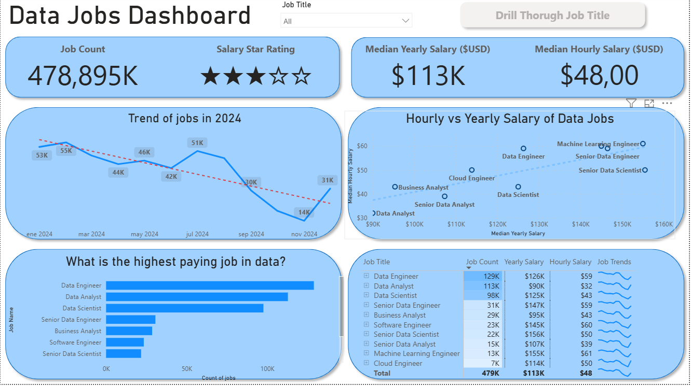
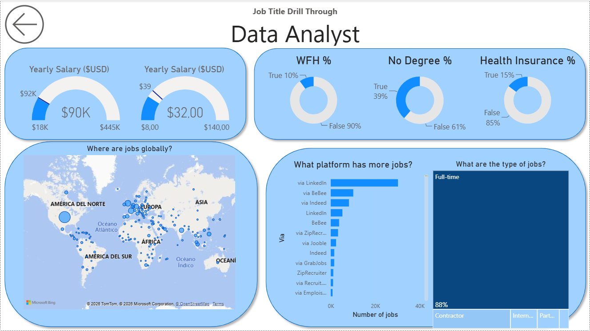

# 📊 Data Jobs Analytics Dashboard (Power BI)

An interactive **Power BI** dashboard focused on a global market analysis of the data industry. This project analyzes job posting volumes, salaries, temporal trends, and key hiring characteristics using a dynamic and intuitive user experience (UX).

---

## 🚀 Key Features

* **Dynamic Drill-Through Logic:** The report features a high-level summary page and a built-in **Drill-Through** breakdown system, allowing users to dive deep into specific metrics for any role (e.g., *Data Analyst*, *Data Engineer*) with a single click.
* **Cross-Salary Analysis:** Evaluation of the relationship between median hourly rates and yearly salaries to identify the most lucrative and high-demand positions.
* **Global Geospatial Mapping:** Interactive map visualization to pinpoint the main hubs of job demand worldwide.
* **Data Quality & UX Focus:** Consistent currency formatting ($USD), clear categorization of employment benefits (Health Insurance, WFH %, Degree requirements), and smooth page navigation.

---

## 📁 Dashboard Structure

The report consists of two main interconnected tabs:

### 1. Main Tab: Market Overview
This section provides a macro view of the data sector, enabling users to analyze hiring trends and compare different positions.

* **Global KPIs:** Total job volume (Job Count), salary star rating, and overall median salaries (both yearly and hourly).
* **Temporal Evolution:** A line chart showing the trend and fluctuations of data job openings throughout the year.
* **Salary Matrix (Scatter Plot):** Correlates median hourly salary against median yearly salary by job title.
* **Top Jobs:** A bar chart displaying the roles with the highest volume of available vacancies.

### 2. Detail Tab: Role Drill-Through (e.g., Data Analyst)
By selecting a specific role on the main page and clicking the **"Drill Through Job Title"** button, the report dynamically filters to reveal deep insights for that particular title:

* **Salary Distribution Metrics:** Gauge charts showing minimum, maximum, and median salary ranges.
* **Benefits & Requirements:** Donut charts analyzing the percentage of remote work (WFH %), listings that do not mention a college degree (No Degree %), and health insurance coverage.
* **Geographical Distribution:** A global bubble map displaying job posting density by continent and country.
* **Platforms & Job Types:** A breakdown of the top sourcing platforms (LinkedIn, Indeed, etc.) and job contract types (Full-time, Contractor, Part-time).

---

## 🛠️ Tech Stack

* **Visualization Tool:** Power BI Desktop
* **Microsoft Bing Maps:** Geospatial integration for international market visualization.

---

## 📈 Key Insights from the Dashboard
* **Machine Learning Engineer** and **Senior Data Scientist** roles lead the market with a median yearly salary exceeding $150K USD.*
* *Approximately **39%** of Data Analyst job postings accept candidates with **No Degree**, highlighting a highly accessible entry point for career switchers.*

---

## 🛠️ How to View the Project

1. Download the `.pbix` file included in this repository.
2. Open the file using [Power BI Desktop](https://powerbi.microsoft.com/desktop/).